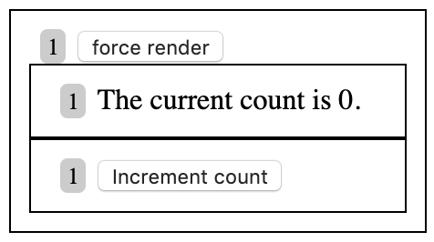
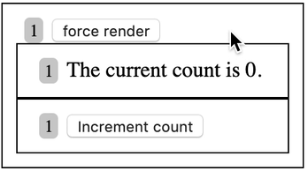
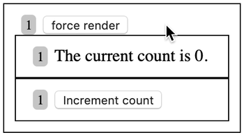

When I
[explained how I create and use context for my React applications](/blog/how-to-use-react-context-effectively),
I touched briefly on the importance of using React's `useMemo` hook. Here's that
example again:

```javascript {8-14}
// src/count-context.js
import React from 'react'

const CountContext = React.createContext()

function CountProvider(props) {
  const [count, setCount] = React.useState(0)
  const value = React.useMemo(() => {
    return {
      count,
      setCount,
    }
  }, [count])
  return <CountContext.Provider value={value} {...props} />
}

function useCount() {
  const context = React.useContext(CountContext)
  if (!context) {
    throw new Error('useCount must be used within a CountProvider')
  }
  const {count, setCount} = context
  const increment = React.useCallback(() => setCount(c => c + 1), [setCount])
  return {
    count,
    increment,
  }
}

export {CountProvider, useCount}
```

I got a lot of questions about why `useMemo` is necessary here, so I'm going to
demonstrate how _not_ using `useMemo` _can_ result in unnecessary re-renders for
folks who want to use `React.memo` (which is like `PureComponent` and
`shouldComponentUpdate` for function components).

Here's the final app that we're going to build to demonstrate this:

[](https://codesandbox.io/s/ryyqj2nl6n)

The boxes each represent an individual component and the number in gray
represents the render count of that component. Here's the codesandbox:

https://codesandbox.io/s/ryyqj2nl6n?view=editor

Here's the basic structure of the components:

```javascript
<App>
  <CountProvider>
    <CountDisplay />
    <Counter />
  </CountProvider>
</App>
```

So when `<App />` re-renders, it'll re-render all of the other components. Most
of the time this isn't a problem, mostly because the `<App />` shouldn't
re-render very often. But you could imagine this being in any part of the tree
of our application. Let's say that rendering `<CountDisplay />` and
`<Counter />` is expensive for one reason or another, so we've put that in a
`React.memo`.

With that setup, we can click the "force render" button which will trigger a
re-render of the `<App />` component, but because the props to the memoized
`<CountDisplay />` and `<Counter />` components does not change, those don't
re-render.

Great! We're all set to reveal this problem. You'll notice that things are only
re-rendering when they should. Let's click on "force render" three times and
"Increment count" twice:



Notice that the `<App />` has now been rendered 4 times and the others have only
been rendered 3 times. This is exactly what we want. The count components get a
re-render only when they need it, which is what we get from `React.memo`.

So now let's remove the `useMemo` from the context provider:

```javascript {3}
function CountProvider(props) {
  const [count, setCount] = React.useState(0)
  const value = {count, setCount}
  return <CountContext.Provider value={value} {...props} />
}
```

Now let's try to do the same thing again:



Oh no! Everything is getting rendered when we click "force render" and the
memoized components are getting re-rendered anyway. So why is that happening?
It's happening because of the way that React context works.

From
[the React `Context.Provider` documentation](https://reactjs.org/docs/context.html#contextprovider):

> All consumers that are descendants of a Provider will re-render whenever the
> Provider’s `value` prop changes. The propagation from Provider to its
> descendant consumers is not subject to the `shouldComponentUpdate` method, so
> the consumer is updated even when an ancestor component bails out of the
> update.
>
> Changes are determined by comparing the new and old values using the same
> algorithm as `Object.is`.

That last bit is the important part. `Object.is` is really similar to `===`.

So `const value = {count, setCount}` in the `CountProvider` function is creating
a brand new object every time it's called. So when React does it's check
`Object.is(previousValue, newValue)`, it will _always_ be false, meaning that
_every_ time `CountProvider` is re-rendered, _every_ context consumer will be
re-rendered as well, even if the actual relevant values are unchanged.

And by the way, we can't solve this by memoizing `CountProvider` with
`React.memo`, because the `children` prop will change every render, so it wont
be effective anyway.

## Conclusion

Most of the time, this wont be a huge deal, especially if your context value
doesn't change very often, but it's normally pretty easy to memoize the value
with `React.useMemo` anyway so may as well do it all the time for your context
value and avoid the problem.
