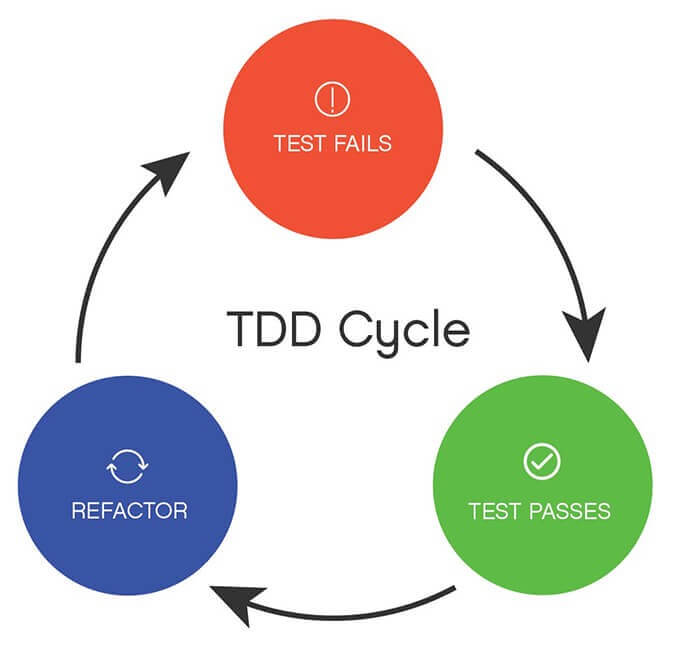

We all have stories where automated tests could've saved us from disaster, but I
want to tell you a story of a time when I went overboard with a certain testing
practice and it went really badly for me...

This was a few years ago. I was working on
[angular-formly](https://github.com/formly-js/angular-formly) and I had just
discovered React's PropTypes feature. I thought it was the coolest thing since
sliced bread. lol, I just looked it up and
[my first issue](https://github.com/facebook/react/issues/2206) on the React
repo was asking if we could add an objectWith PropType validator. I wrote the
whole thing including tests and put that in the issue. Sophie Alpert responded
with:

> _Isn't this what React.PropTypes.shape is for?_

Ha! Whoops! Anyway, I decided it'd be really cool to have development-only
runtime validation on the configuration object that people pass to
angular-formly when configuring their forms.

[My second issue](https://github.com/facebook/react/issues/3079) on the React
repo was asking if the React team would be willing to extract prop types into
its own package (this has actually now taken place! Checkout
[prop-types](http://npm.im/prop-types)). That didn't work out, so I decided to
write my own package and thus
[api-check](https://github.com/kentcdodds/api-check) was born!

One of the cool things about a library like this is that the whole thing is a
bunch of pure functions! And we all know that pure functions are super easy to
test, right?! Also, because I had a very clear picture of what I wanted to
implement (with prop-types as my inspiration) I thought test-driven development
would be a synch.

So I set to work. I started writing a bunch of tests and implemented api-check
as I went. Honestly, it was exhilarating. (I'd say intoxicating, but I've never
actually had a drop of alcohol in my life, so I wouldn't know 😅). I was having
a blast writing this out.

But as time went on, I started noticing something... It was becoming
progressively less fun and more difficult to implement the behaviors as I added
them. The library code started getting really complicated. Now I shudder even
thinking about it. There's no way you could convince me to work on that code
anymore.

So what went wrong? I thought TDD was the process by which you create
beautifully and intentionally designed software. But what I was left with is a
mess that I don't want to touch. I must have done something wrong...

I did. TDD is a three-step process. It's often referred to as the "red, green,
refactor cycle"

Here's the way it works:

- 🚨 **Red**: Write a test for the function/module you're going to create before
  it exists/supports the feature you're adding. This gives you a test that fails
  (you get a "red" error message).
- ✅ **Green**: Implement just enough code to get that test passing (you get a
  "green" success message).
- 🌀 **Refactor**: Look over the code you have written and refactor it to ensure
  it's well-written, as easy as possible to read/understand, and well-designed.
  (The cool thing with this step is that you now have a test in place that will
  tell you if you break something as you refactor).
- 🔁 **Repeat**: It's a cycle, after all 😉 Keep going until you've finished
  implementing everything you need to.

So where did I go wrong with api-check? Well, I kinda skipped the refactor step.
I got so excited from the "high" (another thing of which I'm ignorant) that I
felt from turning that red test to a green test that I just continued on with
the next feature without stopping to consider if what I was building was at all
maintainable. Turns out it wasn't. I was building a monstrosity of
difficult-to-understand code. The code was legacy the second it left my fingers.

### Conclusion

So, what do we learn from this? Test-driven development is awesome, and it can
really help you develop great code in certain situations. But if you skip the
refactor step and aren't intentional about what you're building, it can lead to
disaster.

Be careful out there, friends. And learn to use TDD the right way with me at
[TestingJavaScript.com](https://testingjavascript.com/?utm_source=kcd-list&utm_medium=email&utm_campaign=early-bird)
🏆
